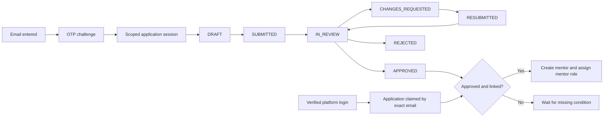

# Guest Mentor Application — Source of Truth

Last updated: 22 July 2026
Owner: SharingMinds engineering
Implementation branch: `arm-kan-232`

## Purpose

This document is the authoritative technical and product reference for the standalone
SharingMinds mentor onboarding flow at `/verified-experts`. It must be updated in the same
change whenever the application schema, OTP rules, API contract, account-linking rules,
review lifecycle, storage policy, or rollout status changes.

The onboarding application accepts mentor applications before a visitor has a SharingMinds
platform account. Email ownership is verified with an application-scoped OTP. A later,
verified Better Auth account can claim the application by exact normalized email. Guest
application verification is not a platform login and does not create a Better Auth user.

## Non-negotiable invariants

1. `mentors.user_id` remains non-null and unique.
2. Guest submission never creates a placeholder `users` row.
3. Guest submission never creates a `mentors` row or grants the `mentor` role.
4. An application is promoted to `mentors` only when it is approved and linked to a verified,
   active, unblocked platform user.
5. Email linking uses only `trim + lowercase`; Gmail dot/plus transformations and fuzzy
   matching are prohibited.
6. OTP verification grants access only to one mentor application. It is not a Better Auth
   session and must not mark an unrelated platform account verified.
7. OTPs, application-session tokens, and private file credentials are never stored in
   plaintext.
8. Resumes and pre-approval profile images remain in private storage.
9. Submission data, required legal-document consent, and the immutable submission revision
   are committed as one logical operation.
10. Claiming and promotion are idempotent and concurrency safe.
11. Migrations 003 and 004 are schema-first: both must succeed before this code version is
    deployed. Migration 003 provides the guest aggregate and secure OTP infrastructure;
    migration 004 provides the version-two application and mentor-profile columns. Guest
    onboarding and application-table integration remain unavailable until
    `MENTOR_APPLICATIONS_ENABLED=true` is deliberately enabled.
12. Every public expert-registration CTA uses the canonical `/verified-experts` entry directly.
    Guest CTAs must never require Better Auth login or start Google/LinkedIn authentication;
    platform authentication remains a later, separate account-linking concern.

## Lifecycle



Application review state and identity-link state are separate. `linked_at` and `promoted_at`
record identity progress; neither is an application review status.

## Data model

### `mentor_applications`

The staging aggregate contains the verified email, typed form fields, review state, optional
platform linkage, and promotion result. There is one durable application per normalized
email; resubmissions are captured as immutable revisions.

Important columns:

- `id`, `email`, `normalized_email`, `email_verified_at`
- `status`, `source`, `current_revision`, `application_schema_version`
- `linked_user_id`, `mentor_id`, `linked_at`, `promoted_at`
- Typed identity, location, professional, rate, availability, biography, and LinkedIn fields
- Applicant-visible and internal review notes
- Submission, review, decision, creation, and update timestamps

### `email_otp_challenges`

Purpose-bound OTP challenges store an HMAC digest, key identifier, attempt count, expiry,
consumption/revocation timestamps, delivery timestamps, and privacy-preserving request
metadata. Only one unconsumed/unrevoked challenge may exist per normalized email and purpose.

Purposes:

- `ACCOUNT_EMAIL_VERIFICATION`
- `MENTOR_APPLICATION_ACCESS`
- `MENTOR_APPLICATION_CLAIM` is reserved for a future account-bound email-change workflow
  and has no public route in this release.

### `mentor_application_sessions`

A verified applicant receives a random high-entropy opaque token in a `Secure`, `HttpOnly`,
`SameSite=Lax` cookie. Only its digest is stored. The session is scoped to mentor-application
routes and contains no platform privileges. Navigating to the public site or using “Back to
home” must preserve this cookie so returning to `/verified-experts` restores the verified email,
draft, or submitted status without another OTP. Only the explicit “Use another email” action
calls `DELETE /api/mentor-applications/session`; that route revokes the server-side digest and
clears only this scoped cookie, never a Better Auth session.

### Supporting records

- `mentor_application_revisions`: immutable snapshots for submit/resubmit with a unique
  idempotency key.
- `mentor_application_events`: append-only audit events for verification, status, claiming,
  conflicts, and promotion.
- `mentor_application_files`: private bucket/object metadata, checksum, detected MIME type,
  size, and kind. Scan-state columns are retained as dormant scaffolding for a future malware
  scanning enhancement but are not used by the current runtime.
- `consent_events.mentor_application_id`: binds server-recorded legal consent to the
  submitted application.

## Expert application form version 2

The CEO-proposed expert application form is the approved product direction for the next form
revision. Scoring, weighting, and automated acceptance rules shown in the proposal are outside
the current scope. The next revision must extend the existing guest-application aggregate; it
must not create a parallel registration table or write anonymous applicants directly to
`mentors`.

Confirmed product decisions on 22 July 2026:

- Ten or more years of experience is **not** an eligibility requirement. The form must offer
  non-overlapping experience bands below ten years and submission must not enforce a ten-year
  minimum. Final band labels may be refined with product, but applicants below ten years must
  be able to submit.
- A profile photo is required at final submission and remains required for mentor promotion.
- Location continues to use the existing normalized country, state, and city identifiers and
  labels. These high-cardinality values use searchable controls rather than radio buttons.
- Video introduction is excluded from the next implementation. A video URL or direct-to-private-
  storage upload may be reviewed as a future enhancement; no video field, upload kind, or
  submission requirement is added now.
- The prior mentoring/advisory question and the professional-misconduct question are removed from
  the applicant experience and from the current draft/submit API contract. Their nullable database
  columns remain only for backward compatibility with historical records and require no migration.
- The five current legal acknowledgements remain required, but checking them is sufficient. Policy
  review is available through an optional link; there is no document modal, reopen behavior, or
  scroll-to-bottom gate.

Control semantics for the next form revision:

- Radio groups are used for bounded single-choice values such as employment type, experience
  band, preferred session mode, and weekly availability.
- Checkbox groups are used for industries, expertise, credibility indicators, mentoring
  interests, and other multi-select values. Expertise permits at most five selections; it does
  not require five selections.
- Searchable normalized selectors remain in use for country, state, and city. Large language
  catalogs must also use a searchable multi-select rather than hundreds of radio controls.
- Conditional text is required when an applicant selects an `Other` option.
- Resume and profile photo are required at submission. Supporting portfolio, case-study,
  presentation, and award/certification files remain optional.
- LinkedIn and optional website controls accept either an absolute HTTP(S) URL or a familiar
  host-first value such as `www.linkedin.com/in/name`; host-first input is normalized to HTTPS
  before persistence. URL parsing is exception-safe, and LinkedIn validation accepts only the
  `linkedin.com` host or its subdomains, never lookalike suffixes.
- Every step transition runs the same shared validation contract used by final submission.
  Failures keep the applicant on the current step, display a prominent accessible error summary,
  retain field-level messages and invalid-control styling, and scroll/focus the first invalid
  control. Correcting a field removes its stale error state.

The implemented version-two application fields include a distinct professional headline, website,
employment type, experience band, industries, challenge solved, measurable outcomes, guidance
value proposition, credibility signals, service interests, preferred session mode, languages,
and weekly availability band.
The exact field contract is introduced by additive migration 004 and
`application_schema_version = 2`; migration 003 remains immutable.

On approval and verified-user linkage, public and operational profile data is promoted to
`mentors`. Professional headline maps to the existing `headline`, designation to `title`,
organization to `company`, professional journey to `about`, and website to `websiteUrl`.
New durable mentor fields are required for multi-industry experience, experience band,
credibility, service interests, preferred session mode, languages, weekly availability band,
and the additional guidance/outcome narratives. Exact `experienceYears` must remain null when
only a range was supplied, and `hourlyRate` remains null until later pricing onboarding.
Internal review data, declarations, and supporting verification evidence remain application-only
and must never be exposed through public mentor payloads. Historical screening responses remain
in nullable application columns but are not returned to the current applicant UI, written by the
current API, or promoted for new applications.

## API contract

| Method | Route | Authorization | Purpose |
| --- | --- | --- | --- |
| `POST` | `/api/mentor-applications/email/request` | Public + rate limits | Create and send an application OTP challenge |
| `POST` | `/api/mentor-applications/email/verify` | Challenge ID + OTP | Consume OTP and issue application session |
| `POST` | `/api/mentor-applications/session` | Verified Better Auth session | Establish application session without a second OTP |
| `DELETE` | `/api/mentor-applications/session` | Application session | Explicitly forget verified application access when switching email |
| `GET` | `/api/mentor-applications/current` | Optional application session | Load the current draft/status, or return `200` with `application: null` when no scoped session exists |
| `PATCH` | `/api/mentor-applications/current` | Application session | Autosave validated draft fields |
| `POST` | `/api/mentor-applications/current/submit` | Application session | Upload private files and submit atomically |
| `POST` | `/api/mentor-applications/claim` | Verified Better Auth session | Claim exact-email application and promote if approved |
| `GET` | `/api/mentor-applications/files/:id` | Applicant, linked user, admin, public approved image, or internal service | Authorize a private file and issue a short signed redirect |
| `POST` | `/api/mentor-applications/:id/review` | Verified admin | Apply a valid review transition and retry promotion |
| `POST` | `/api/internal/mentor-applications/claim` | Internal service bearer secret | Let the main platform claim by verified database user ID |
| `POST` | `/api/internal/mentor-applications/reconcile` | Internal service bearer secret | Retry approved, linked, unpromoted applications in bounded batches |

The server derives the applicant email from the scoped session. Client-supplied email is
never accepted as proof of identity.

## OTP and abuse controls

- Cryptographically random six-digit code.
- HMAC digest with a server-only pepper and challenge context; never plaintext or bare hash.
- Ten-minute expiry and maximum five verification attempts.
- Sixty-second resend cooldown.
- Email-window request limits are always enforced in shared persistence. IP-window limits are
  additionally enforced when the deployment supplies a trusted, proxy-overwritten IP header.
- Resend revokes the previous active challenge.
- Verification consumes the challenge exactly once.
- Request responses are generic to prevent user/application enumeration.
- Mutating cookie-authenticated routes validate the request origin.
- Authentication callback URLs are restricted to same-origin paths; email addresses and proof
  tokens are not placed in verification URLs.
- CAPTCHA can be enabled after suspicious thresholds without changing the identity model.

## Account claiming and mentor promotion

The SharingMinds platform login flow detects a candidate by exact normalized email only after
Better Auth reports that email as verified. Password accounts must complete platform email
verification. OAuth accounts are eligible only when the provider/Better Auth records the
email as verified; otherwise a fresh OTP to the application email is required.

Claiming locks or conditionally updates the application and applies these rules:

- Already linked to the same user: idempotent success.
- Linked to another user: block, audit, and require manual support.
- Logged-in email differs: do not auto-link. The differing-email claim flow is unsupported in
  this release and requires manual support; the reserved claim OTP purpose must not be exposed
  without an account-bound design and audit review.
- Existing mentor for the user: never overwrite; require reconciliation.
- Later user email changes do not move the application; `linked_user_id` becomes canonical.

Promotion is invoked after claim or admin approval. It re-reads the linked user inside the
transaction, creates exactly one `mentors` row, copies approved fields,
sets `verification_status = VERIFIED` and `is_verified = true`, uses
`creation_source = SELF_REGISTERED`, assigns the mentor role with the reviewer as the audit
actor, records `mentor_id` and `promoted_at`, and appends an audit event atomically.

## File and consent policy

- Storage bucket: `SUPABASE_MENTOR_APPLICATIONS_BUCKET`, default `mentor-applications`.
- Bucket is private; files are reached only through an authorized stable endpoint that
  issues a short-lived signed redirect.
- Object names use application/file UUIDs and never contain email addresses.
- Profile images: JPEG, PNG, or WebP, checked by file signature and size.
- Resumes: required PDF, checked by `%PDF` signature and limited to 2MB on both the client and
  server.
- Portfolio, case-study, presentation, and award/certification evidence: optional PDF, checked
  by `%PDF` signature and size. One current file per category is retained.
- Profile images and optional evidence files are limited to 5MB each; resumes are limited to 2MB.
  The complete multipart request remains limited to 31MB so the required profile/resume and four
  optional evidence categories can be submitted together.
- Upload uses `upsert: false`; partial failures clean up newly uploaded objects.
- The current release accepts files immediately after the size, MIME, and signature checks
  above. It does not perform malware scanning and does not gate file delivery or promotion on
  `scan_status`.
- The existing scan-state columns and enum remain in PostgreSQL only to avoid a destructive
  rollback of migration 003 and to make a future scanning enhancement additive. There is no
  scanner callback route or scanner secret in the current runtime.
- Future hardening may add asynchronous malware scanning, quarantine, and verdict enforcement.
  That work is explicitly deferred and is not a current rollout gate.
- Legal consent is accepted per document ID and version and written by the submission route,
  not a fire-and-forget client beacon.
- Selecting all five consent checkboxes is the complete acceptance action. Opening policy text and
  scrolling through it are not submission prerequisites.
- Each legal document carries its own version in `lib/legal-documents.ts`. The platform policies
  currently use `2025-11`; the expert-application declaration uses `2026-07`. A version must
  change whenever that document's content changes.
- Required retention jobs for expired challenges/sessions, abandoned drafts, superseded
  objects, and orphaned files are a deployment prerequisite; they are not implemented here
  because retention durations still require product/legal approval.

## Cross-application integration

This standalone onboarding application and the main SharingMinds platform share the database,
but claiming/promotion logic has one server-owned implementation. The main platform calls
`POST /api/internal/mentor-applications/claim` after it establishes a verified session; the
service accepts only `userId` and independently re-reads eligibility and canonical email from
the database. Never duplicate claim rules in browser code.

Both login/claim and admin approval invoke the same idempotent promotion function. A scheduled
reconciliation job retries rows matching:

```text
status = APPROVED
linked_user_id IS NOT NULL
mentor_id IS NULL
```

In this repository, reconciliation is invoked after Better Auth session creation, immediately
after account-email OTP verification, from the explicit claim endpoints, from the verified
user's application-session bootstrap, and through the bounded internal reconciliation
endpoint. The batch endpoint orders candidates by application UUID
and returns an opaque `nextCursor`; callers continue with that cursor until `hasMore=false`.
This guarantees that a blocked row in an early batch cannot starve later candidates. A later
scheduled run starts without a cursor to retry still-blocked rows. Failures never block login
and remain safe to retry.

Promoted file URLs use the canonical `APP_BASE_URL`. A separately hosted main-platform backend
can fetch private files with `MENTOR_APPLICATION_INTERNAL_API_SECRET` and proxy them to
its authorized user; that secret must never be sent to browser code.

The main SharingMinds repository and this standalone application both declare the version-two
`mentors` columns. Migration 004 is the shared database authority; neither repository should
generate or push an independent competing migration for these columns.

### Temporary platform-access experience

`/auth/login` currently presents a premium private-access preview rather than platform login
controls. This is an intentional product state while the broader SharingMinds member experience
is being prepared; it is not an authentication error or a dependency of expert onboarding.

- Desktop and mobile navigation continue to link to `/auth/login`, preserving the permanent
  route contract and avoiding temporary URL rewrites.
- The page does not render or initiate email/password, Google, or LinkedIn authentication.
- Better Auth services, account-verification routes, protected-route guards, and database
  structures remain intact for later activation. Reintroducing login is a presentation-layer
  change and must not replace the guest application session with a platform session requirement.
- `/verified-experts` remains the public expert-verification entry point. It uses its own
  email-OTP application session and does not require a SharingMinds account.
- Visitors arriving at the private-access page can return home or continue directly to expert
  verification. No waitlist or lead-capture promise is displayed because no corresponding
  persistence or operational follow-up workflow currently exists.
- The temporary route is marked `noindex, nofollow`; it may be made indexable only when the
  production client-access experience and its canonical metadata are approved.

## Migration and compatibility policy

- Existing linked `mentors` rows remain unchanged.
- During rollout, authenticated status checks consult `mentors` first, then
  `mentor_applications`.
- Production defaults guest onboarding and application-table integration off until
  `MENTOR_APPLICATIONS_ENABLED=true`. Apply and verify migration 003, then apply and verify
  migration 004 before deploying this code version with the flag off. Verify the private bucket
  and cross-app integration before enabling the flag. Both migrations must precede this code.
- The legacy `email_verifications` runtime is retired. Its database declaration/table remains
  temporarily for rollback-safe retention, is marked deprecated, and has no runtime readers or
  writers. Remove the table later through an explicit cleanup migration after rollout evidence.
- Platform account OTP endpoints now require an authenticated session, bind the challenge to
  that session's email, use the shared purpose-bound digest/attempt/rate-limit service, and
  update `users.email_verified` transactionally after successful verification.
- Before applying migrations, audit case-insensitive duplicate user emails and existing schema
  type drift (`roles.id` UUID vs `user_roles.role_id` text; `users.id` text vs
  `mentees.user_id` UUID).
- Production uses reviewed SQL migrations; direct schema push is prohibited.
- Migration 003 enables RLS on every new staging table and on `consent_events`; it deliberately
  adds no anon/authenticated PostgREST policy. Migration 004 is additive and does not relax RLS.
- Drizzle migration tooling is configured in `drizzle.config.ts`. This legacy database does
  not yet have a Drizzle migration baseline, so migrations 003 and 004 are hand-reviewed
  additive SQL migrations in `documentation/migrations/`. Do **not** run `db:generate` or `db:migrate`
  against the shared database until its existing schema has been introspected and baselined;
  otherwise Drizzle may attempt to recreate pre-existing tables.

## Environment variables

| Variable | Required | Purpose |
| --- | --- | --- |
| `MENTOR_APPLICATIONS_ENABLED` | Production rollout | Enable application-table reads only after migration verification |
| `MENTOR_APPLICATION_OTP_SECRET` | Yes | HMAC pepper for application OTP digests |
| `MENTOR_APPLICATION_OTP_KEY_ID` | No | Identifier stored with new OTP digests to support deliberate key rotation; defaults to `v1` |
| `MENTOR_APPLICATION_SESSION_SECRET` | Yes | Digest/key separation for application sessions |
| `MENTOR_APPLICATION_INTERNAL_API_SECRET` | Cross-app production | Authenticate main-platform claim, reconcile, and clean-file proxy requests |
| `MENTOR_APPLICATION_TRUSTED_IP_HEADER` | Production abuse controls | Proxy-overwritten client IP header used for hashed IP rate limits |
| `MENTOR_APPLICATION_ALLOWED_ORIGINS` | Cross-origin deployment | Comma-separated trusted origins permitted for mutating requests in addition to canonical app/auth origins |
| `MENTOR_APPLICATION_COOKIE_NAME` | No | Override scoped cookie name |
| `SUPABASE_MENTOR_APPLICATIONS_BUCKET` | No | Private bucket name; defaults to `mentor-applications` |
| `APP_BASE_URL` | Production | Trusted origin for mutation checks and generated links |
| `GMAIL_APP_USER` | Yes | OTP sender identity |
| `GMAIL_APP_PASSWORD` | Yes | SMTP app credential |

Secrets are server-only and must never use a `NEXT_PUBLIC_` prefix.

## Production activation checklist

1. **Complete (22 July 2026):** The duplicate-email and legacy type-drift preflight passed.
   Keep `MENTOR_APPLICATIONS_ENABLED=false` until the remaining activation gates below pass.
2. **Complete (22 July 2026):** Migration
   `documentation/migrations/003-guest-mentor-applications.sql` was applied manually and its
   expected tables, constraints, indexes, RLS, and account-OTP schema checks passed.
3. **Complete (22 July 2026):** The private Supabase bucket `mentor-applications` was created.
   It must remain private with no anon/authenticated object-read policies.
4. **Deferred:** Malware scanning and quarantine are documented as a future enhancement and
   are not required for the current rollout.
5. **Pending database execution:** Apply
   `documentation/migrations/004-expert-application-v2.sql`, then run
   `004-expert-application-v2-verification.sql`. Both missing-item queries must return zero rows.
6. Enforce an upstream request-body limit of 31MB. The route also checks `Content-Length`, but
   application code alone cannot stop an oversized chunked body before `formData()` buffers it.
7. **In progress:** Dedicated local secrets were user-confirmed on 22 July 2026. Production
   secret deployment, canonical `APP_BASE_URL`, and a trusted proxy-overwritten client-IP
   header remain pending. Set `MENTOR_APPLICATIONS_ENABLED=true` only after every gate passes.
8. Wire the main platform's verified-login hook to the internal claim endpoint, use the
   server-to-server private-file proxy contract when origins differ, and schedule cursor-based
   bounded reconciliation passes.
9. Define and implement legal retention jobs before accepting production PII.

## Verification matrix

- [ ] Guest requests OTP without creating a user/application junk row.
- [ ] OTP expiry, resend revocation, replay, and attempt exhaustion work.
- [ ] Guest verifies email and receives only an application-scoped session.
- [ ] Guest can load/save/submit the application without platform login.
- [ ] Submission creates no `users`, `mentors`, or `user_roles` record.
- [ ] Consent and revision are bound to successful submission.
- [ ] Resume and pre-approval image have no permanent public URL.
- [ ] Unverified platform account cannot claim.
- [ ] Verified exact-email account claims once under concurrent attempts.
- [ ] Approval-before-login and login-before-approval both promote exactly once.
- [ ] Existing mentor conflict does not overwrite operational data.
- [x] Version-two validation accepts experts below ten years and enforces no ten-year minimum.
- [x] Expertise option cards enforce one-to-five selections and disable a sixth selection.
- [x] Radio and checkbox cards hydrate and change state correctly at desktop and 390px widths.
- [x] The version-two wizard has no horizontal overflow at 390px.
- [x] Bare LinkedIn/website hostnames normalize to HTTPS; malformed and lookalike LinkedIn URLs
  produce validation messages without throwing a browser runtime exception.
- [x] Missing and invalid step fields produce an accessible summary, individual messages, invalid
  control styling, and focus movement to the first failing control.
- [x] Header, homepage hero/final, About-page, and related public expert-registration CTAs route
  directly to `/verified-experts` without a login callback or social-auth detour.
- [x] Back-to-home navigation preserves the scoped guest session; returning to the application
  restores the OTP-verified email/application, while “Use another email” explicitly revokes it.
- [x] A visitor without Better Auth or an application session can use the public site normally;
  the optional current-application probe returns `200`/`null` rather than an authentication error.
- [x] Desktop and 390px mobile `/verified-experts` guest-entry states pass compiled-browser verification.
- [x] With `MENTOR_APPLICATIONS_ENABLED=false`, the compiled page renders the unavailable
  state and application API middleware returns `503` without reaching the database.
- [x] `npx tsc --noEmit` and the Next.js production build pass.
- [x] `npm test` passes for canonical email, OTP/session/internal-service digests, redirect
  safety, consent
  versioning, and draft/submit validation boundaries.
- [x] npm and pnpm dependency audits report zero known vulnerabilities.

## Implementation status

| Phase | Status | Notes |
| --- | --- | --- |
| Architecture and invariants | Complete | Approved design captured above |
| Drizzle schema and SQL migration | Applied | Migrations 003 and 004 are active in the connected database; the supplied read-only verification remains the canonical audit |
| OTP and application-session services | Complete | Purpose-bound OTP, scoped cookie, revocation, rate limits, and trusted-origin checks |
| Draft, files, submission, consent APIs | Complete | V2 autosave, strict submit/revision/consent, required profile and 2MB resume, optional evidence, and private delivery |
| Claiming and promotion | Complete | V2 public/operational fields promote idempotently; historical screening and review data remain application-only |
| `/verified-experts` OTP-first UI | Complete | Eight-step radio/checkbox form, normalized locations, autosave, resubmission, direct legal acknowledgement, and lifecycle views |
| Temporary `/auth/login` experience | Complete | Premium private-access preview; platform auth backend retained and expert OTP onboarding remains independently accessible |
| Automated verification | Complete | TypeScript, production build, 24 unit tests, and zero known validation regressions |
| Browser verification | Complete | Guest home/application navigation, public CTA routing, guest bootstrap, validation alert/focus behavior, safe bare/malformed LinkedIn handling, hydrated option state, expertise limit, and 390px overflow checks pass |
| Database-backed E2E verification | Pending | Execute the full OTP-to-v2-submission-to-promotion lifecycle against the applied schema |
| Private Supabase storage | Complete | User-confirmed creation of the private `mentor-applications` bucket on 22 July 2026 |
| Server environment | In progress | Dedicated local secrets are configured; production deployment and trusted-proxy configuration remain pending |
| Malware scanning | Future enhancement | Runtime callback, quarantine, and promotion gates were removed; database scan columns remain dormant |
| Retention jobs | Pending deployment | Product/legal retention durations and cleanup schedules remain to be implemented |
| Production database migration | Applied | Migration 003 is verified and migration 004 columns are active in the connected database |

Current environment note: the earlier local `DATABASE_URL` authentication failure did not
prevent manual execution in Supabase. On 22 July 2026, the user confirmed that migration 003
and all supplied post-migration verification queries completed with the expected results.
Migration 004 is now active, as confirmed by successful runtime access to its version-two
application columns; its read-only verification script remains available for repeatable auditing.

## Change log

### 20 July 2026

- Established the separate `mentor_applications` staging boundary.
- Defined OTP, scoped application-session, private-file, consent, claim, and promotion rules.
- Added explicit legal-document versions and documented the required server-only environment
  variables in `.env.example`.
- Added Drizzle Kit and repeatable `db:generate`, `db:introspect`, `db:migrate`, and
  `db:studio` commands. Production schema push remains prohibited. `drizzle-kit check` is not
  exposed because this legacy database has no Drizzle migration journal yet.
- Added a shared same-origin redirect guard and removed email addresses from newly generated
  account-verification URLs.
- Reworked the platform email-verification screen contract to use the signed-in account,
  server-created challenge IDs, masked email display, automatic initial delivery, and no email
  address in the URL.
- Added the complete Drizzle application aggregate and reviewed additive migration
  `003-guest-mentor-applications.sql`, including RLS with no public client policies, canonical
  email collision detection, and immutable idempotent revisions.
- Replaced the detached plaintext account OTP endpoint behavior with authenticated,
  purpose-bound challenges that durably mark the matching Better Auth user email verified.
- Aligned the Drizzle `users.emailVerified` definition with migration 003's non-null verified
  identity invariant.
- Attempted the required read-only live-schema audit; the configured PostgreSQL credential was
  rejected, so no live database reads or writes occurred and migration execution remains
  intentionally pending.
- Completed the responsive `/verified-experts` email → OTP → locked-email form flow, scoped
  session restoration, verified-account bootstrap, debounced autosave, versioned consent
  submission, idempotent retries, changes-requested resubmission, and lifecycle status views.
- Linked this source of truth from both the product overview and technical overview so future
  onboarding changes have one discoverable authority.
- Added a repeatable Vitest unit-test command for the security and validation boundary.
- Added unit coverage for safe redirects, conservative email normalization, OTP purpose
  binding, opaque session-token digests, draft-vs-submit validation, and legal version drift.
- Wired verified Better Auth session creation and successful account-email verification into
  the idempotent claim/promotion service, while preserving login availability on retryable or
  manual-review conflicts.
- Removed the obsolete plaintext OTP service and marked its retained database declaration and
  historical replication guide as deprecated to prevent accidental reuse.
- Retired the legacy `/api/mentors/apply` mutation with `410 Gone` so older clients cannot
  bypass staging, review, and promotion.
- Added explicit scoped-session revocation and guest exit/switch-email controls, including a
  2.5-second guest-entry fallback when platform-auth bootstrap is slow or unavailable.
- Added safe schema-first rollout behavior for app-wide status APIs and exposed linked
  application status without treating applicants as mentors.
- Added default-deny file quarantine, terminal scan verdicts, the authenticated scanner
  callback, clean-file delivery checks, and promotion-time file/user eligibility checks.
- Added internal main-platform claim, clean-file proxy authorization, and bounded
  reconciliation contracts using a dedicated server-to-server secret.
- Enabled RLS for guest-linked `consent_events`, added an 11MB declared-body guard, and made IP
  throttling depend on an explicitly trusted proxy header rather than spoofable defaults.
- Upgraded to patched Next 15.5.20, Better Auth 1.6.23, Drizzle ORM 0.45.2, and Nodemailer
  9.0.3; pinned the established UI dependency majors; and verified zero known npm/pnpm audit
  findings with no peer dependency errors.
- Recorded scanner production, upstream body-limit, database migration, private bucket,
  cross-app wiring, and legal retention work as explicit activation gates rather than claiming
  they are already deployed.
- Made the rollout schema-first, defaulted the feature flag off, centrally gated guest/internal
  application routes, and disabled login-time application reconciliation while the flag is off.
- Added deterministic cursor pagination to scheduled reconciliation so blocked early rows do
  not starve later candidates, and routed serialized clean-file links through the stable
  authorization endpoint.
- Verified the compiled guest-entry UI in desktop and 390px mobile browser layouts without
  requesting or sending an external OTP.
- Started implementation on branch `arm-kan-232`.

### 22 July 2026

- Recorded user-confirmed successful execution of migration 003 and its supplied verification
  queries. The feature flag remains off until private storage, cross-app integration,
  and database-backed lifecycle verification are complete.
- Recorded user-confirmed creation of the private Supabase `mentor-applications` bucket. Public
  object access must remain disabled; files are delivered through authorized application APIs.
- Recorded user-confirmed local generation and configuration of dedicated application secrets
  without recording their values. The scanner callback secret is no longer used and may be
  removed from local and hosted environments.
- Removed malware scanning from the current runtime scope: uploads are accepted after size,
  MIME, and signature validation; file delivery and mentor promotion no longer depend on scan
  verdicts. The applied migration's scan columns remain dormant for a future enhancement.
- Recorded the confirmed version-two application decisions: no ten-year experience minimum,
  required profile photo, retained normalized location controls, and deferred video support.
  Also documented the planned form-control semantics and application-to-mentor data boundary;
  scoring and weighting remain outside the implementation scope.
- Implemented the version-two eight-step application with bounded radio groups, checkbox cards,
  normalized locations, one-to-five expertise selection, required profile/resume, optional PDF
  evidence, application declaration consent, autosave, and idempotent submission.
- Added additive migration 004, matching Drizzle schemas, read-only verification queries, and
  promotion mappings for the durable mentor-profile fields. Misconduct responses remain private
  application-only data; video introduction and scoring remain deferred.
- Synchronized the main SharingMinds repository's Drizzle `mentors` declaration with the shared
  migration 004 columns so both applications use the same post-promotion profile contract.
- Increased the documented and enforced multipart ceiling from 11MB to 31MB to accommodate the
  required files and four optional 5MB evidence categories.
- Made LinkedIn and optional website parsing exception-safe, normalized familiar host-first input
  to HTTPS, rejected deceptive LinkedIn lookalike hosts, and added regression coverage.
- Added an accessible step-level validation summary, linked field messages, invalid-state styling,
  stale-error clearing, and automatic scroll/focus to the first field requiring attention.
- Routed all public expert-registration CTAs directly to the OTP-first `/verified-experts` entry,
  removed misleading pre-application Google/LinkedIn authentication actions, and restored generic
  account-creation wording to the standalone login form.
- Preserved the OTP-issued application session across home navigation, limited revocation to the
  explicit email-switch action, made optional session restoration return `200`/`null`, and removed
  the global auth-themed boundary that mislabeled unrelated guest failures as expired login sessions.
- Replaced the visible `/auth/login` controls with a responsive private-client-access preview,
  retained the existing workspace image, added direct home and expert-verification actions, and
  marked the temporary page as non-indexable. Better Auth and account-verification services remain
  available for future platform-access activation.
- Reduced the expert-application resume limit from 5MB to 2MB in client guidance, client validation,
  and server-side storage enforcement while retaining the 5MB limit for profile and supporting
  evidence files.
- Removed the prior mentoring/advisory and professional-misconduct questions from the wizard and
  current API validation contract. The existing nullable database columns remain untouched for
  historical compatibility and are no longer exposed in the applicant response.
- Simplified final consent so checking the five acknowledgements submits directly. Policy content
  remains available through `/policies`, but there is no modal or scroll-depth requirement.
