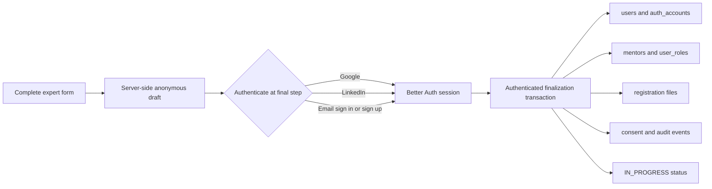

# Live Expert Registration v3: Source of Truth and Implementation Plan

Last updated: 7 August 2026

Status: Implemented in application code; database migration and environment cutover pending

Schema version: `3`
Source value for every new production registration: `LIVE_EXPERT_REGISTRATION`

## 1. Purpose

This document is the source of truth for replacing the guest email-OTP expert application flow
with a form-first, account-backed registration flow.

The intended experience is:

1. A visitor opens `/verified-experts` and completes the existing eight-step expert form.
2. The professional form contains no email input and does not ask for an email OTP.
3. At the final step, the visitor authenticates with Google, LinkedIn, or email and password.
4. Email authentication is presented in a modal with Sign in and Create account modes. Create
   account asks for email, password, and password confirmation.
5. After authentication, the server obtains the email exclusively from the authenticated session
   and atomically creates the expert's mentor registration.
6. New data is written to the canonical `users`, Better Auth `auth_accounts`, `user_roles`,
   `mentors`, file, consent, and audit records. It is not written to `mentor_applications`.

The hundreds of existing records in `mentor_applications` and its supporting tables must remain
unchanged. They will be handled by a separately approved, idempotent migration in the future.

### 1.1 Current implementation state

The branch now contains the complete inactive v3 path. It remains dormant until operations
manually applies and verifies migration 006 and sets `EXPERT_REGISTRATION_V3_ENABLED=true`.
No SQL in this implementation is executed automatically.

Implemented:

- additive Drizzle declarations plus manual migration and read-only verification SQL;
- anonymous, HTTP-only-cookie-bound drafts with seven-day expiry and server-side autosave;
- complete pre-auth validation and private upload of the required profile image/resume plus
  optional supporting evidence;
- Google, LinkedIn, email sign in, email account creation, and existing-session completion;
- locked, idempotent direct creation of the mentor, role, file links, consents, and audit event;
- explicit live provenance, auth method, schema version, normalized location IDs, and campaign
  attribution on the mentor;
- a stable, authorized file-serving endpoint backed by the existing private Supabase bucket;
- legacy creation and legacy auto-claim controls that are independent from legacy read access;
- transitional Excel and campaign reports that union historical applications with live mentors;
  and
- account-backed receipt language and updated public registration copy.

Not performed by this code change:

- production migration execution or flag activation;
- OAuth provider-console callback changes;
- database-backed staging E2E/canary verification;
- legacy application migration or deduplication; and
- automated expired-draft/storage cleanup, which remains an operational follow-up before a long
  retention period is accumulated.

Validation completed on 7 August 2026: TypeScript passed, all 52 Vitest tests passed, and a full
Next.js production build passed with Turbopack, including page-data generation and build traces.
The repository is pinned to Node 22 through `.nvmrc`/`package.json`; the local machine's Node 24
runtime triggers a known-in-environment Webpack `WasmHash` failure before application compilation,
so the standard Webpack build must be rerun in the pinned Node 22 deployment/runtime.

## 2. Confirmed product decisions

- Remove the email field from the professional application form.
- Remove email OTP verification from the new-registration journey.
- Keep the current form questions, validation, normalized location selectors, files, and five
  legal acknowledgements.
- Put authentication at the end of the form.
- Support Google, LinkedIn, existing email/password accounts, and new email/password accounts.
- Preserve all legacy application data for a later migration.
- Store new registrations directly against canonical platform users and mentors.
- Distinguish live production registrations from POC, migrated, platform, and admin-created data.
- Video introduction and application scoring remain out of scope.

The email field still appears inside the email authentication modal because it is required to
sign in or create an account. It must not appear as a professional-form field, and the mentor
creation endpoint must never trust an email submitted as form data.

## 3. Security qualification: removing email verification

Google and LinkedIn generally provide an identity backed by their OAuth/OpenID flow. A new
email/password account without email verification does not prove ownership of the supplied
mailbox. The requested v3 flow will therefore allow submission without an OTP, but it must not
incorrectly set `users.email_verified=true` for an email/password signup.

Consequences of this product decision include typo accounts, account squatting, and a future
collision if the real mailbox owner later uses social login. The implementation must mitigate,
but cannot eliminate, that risk by:

- using Better Auth for account and password creation rather than inserting users manually;
- retaining `users.email_verified=false` for unverified password accounts;
- sending a non-blocking registration receipt to the account email;
- rate-limiting sign-up, draft creation, file upload, and finalization;
- never granting verified-expert privileges merely because an account exists;
- creating the mentor with `verification_status='IN_PROGRESS'` and `is_verified=false`; and
- retaining the option to require mailbox verification for sensitive dashboard/account actions
  later without changing the registration form again.

Password confirmation is a client UX control, not an authentication primitive. The server-side
Better Auth configuration remains the password authority. The proposed policy is 8-128
characters, at least one letter, and at least one number, with no requirement that prevents
long passphrases. The confirmation value is never stored or logged.

## 4. Why a new anonymous draft aggregate is required

Authentication happens after the form, while Google and LinkedIn require leaving the page for an
OAuth callback. React state and browser `File` objects do not reliably survive that redirect.
Storing the entire application, resume, and profile image in `localStorage` would expose sensitive
PII and still would not safely preserve file objects.

The existing `mentor_applications` table cannot be reused safely:

- it requires an email and normalized email;
- it is unique by normalized email;
- it encodes the old guest OTP, application-status, revision, claim, and promotion lifecycle; and
- mixing v3 direct registrations into it would make the planned legacy migration ambiguous.

V3 therefore requires a small, temporary, server-side `mentor_registration_drafts` aggregate.
It is transport state for an OAuth-safe workflow, not the new canonical application database.
After finalization, `users` and `mentors` are canonical.

The browser receives only a random, HTTP-only, secure, SameSite=Lax draft cookie. Only a digest
of the token is stored. Draft APIs are same-origin, rate-limited, server-only database operations.
No PII or storage path is placed in an OAuth query string or callback URL.

## 5. Target architecture



Better Auth alone creates or authenticates `users`, `auth_accounts`, and `auth_sessions`. The
registration finalizer must not hash passwords, create password-account rows, or accept a client
supplied user ID or email.

## 6. User journeys

### 6.1 Google or LinkedIn

1. Validate every form step, required file, and legal acknowledgement.
2. Save the latest validated payload, current legal versions, selected files, and campaign
   attribution to the anonymous draft.
3. Mark the draft `READY_FOR_AUTH`.
4. Start Better Auth social sign-in with an allowlisted callback such as
   `/verified-experts/complete`.
5. Better Auth creates or reuses the user/account and establishes a session.
6. The callback page calls the idempotent finalization endpoint.
7. On success, show the submitted/under-review state.

The recommended implementation uses the provider's normal redirect flow. A custom OAuth popup
is less reliable on mobile browsers and introduces opener/postMessage and popup-blocking failure
modes. The email experience remains a modal as requested.

### 6.2 Existing email/password account

1. Open the email authentication modal on its Sign in tab.
2. Enter email and password.
3. Better Auth authenticates the account and establishes the session.
4. Finalize the draft using the authenticated session email and user ID.

### 6.3 New email/password account

1. Open the modal on its Create account tab.
2. Enter email, password, and password confirmation.
3. Validate the email, password policy, and matching confirmation locally.
4. Call Better Auth `signUp.email` with the professional form's full name, email, and password.
5. Leave `users.email_verified=false` unless Better Auth has independently verified it.
6. Finalize using the newly created authenticated session.

If the email already belongs to an account, offer Sign in without deleting the draft. Passwords,
provider tokens, raw sessions, and password confirmation must never enter draft storage.

### 6.4 Already-authenticated visitor

At the final step, show the session identity and a `Submit as <email>` action instead of asking the
person to authenticate again. The server still re-reads and validates the session during
finalization.

## 7. Additive database design

No existing table or column is dropped, renamed, or repurposed during this release. Existing
rows must not be given a live source value by a blanket default.

### 7.1 New `mentors` columns

| Column | Suggested type | Purpose |
|---|---|---|
| `registration_source` | nullable `mentor_registration_source` enum | Explicit provenance. V3 writes `LIVE_EXPERT_REGISTRATION`; existing rows remain null until audited. |
| `registration_auth_method` | nullable `mentor_registration_auth_method` enum | `GOOGLE`, `LINKEDIN`, `EMAIL_PASSWORD`, or `EXISTING_SESSION`. |
| `registration_schema_version` | nullable integer | V3 explicitly writes `3`; it must not falsely label older rows. |
| `registration_draft_id` | nullable UUID, unique | Idempotency and audit link to the v3 draft. |
| `registration_submitted_at` | nullable timestamptz | Canonical registration-completion time for reports. |
| `country_id` | nullable text | Preserve the normalized selected country ID. |
| `state_id` | nullable text | Preserve the normalized selected state ID. |
| `city_id` | nullable text | Preserve the normalized selected city ID. |
| `other_industry` | nullable text | Preserve the exact conditional response instead of only a flattened display label. |
| `other_expertise` | nullable text | Preserve the exact conditional expertise response. |
| `other_language` | nullable text | Preserve the exact conditional language response. |
| `attribution_visit_id` | nullable UUID FK to `campaign_visits` | Attribute the direct live registration without using `mentor_applications`. |
| `attribution_captured_at` | nullable timestamptz | Audit when attribution was attached. |

Recommended `mentor_registration_source` values:

- `LIVE_EXPERT_REGISTRATION`
- `LEGACY_POC`
- `LEGACY_APPLICATION_MIGRATION`
- `MAIN_PLATFORM`
- `ADMIN_CREATED`

`creation_source` remains useful for the business distinction between `SELF_REGISTERED` and
`ADMIN_CREATED`; `registration_source` answers a different question: which pipeline produced the
record. It should not be named only `source`, because application identity source, campaign
source, authentication provider, and record provenance are separate concepts.

Most current v2 form fields already exist in `mentors`: multiple industries, experience band,
employment type, service interests, languages, weekly availability, preferred session mode,
challenge, outcomes, guidance value proposition, and credibility signals. They should not be
duplicated.

### 7.2 New `mentor_registration_drafts` table

Recommended fields:

- `id` UUID primary key;
- `access_token_digest` unique text, never the raw browser token;
- `status`: `DRAFT`, `READY_FOR_AUTH`, `AUTHENTICATED`, `FINALIZING`, `COMPLETED`, `EXPIRED`, or
  `ABANDONED`;
- `schema_version` integer, explicitly `3`;
- `form_payload` JSONB containing only validated professional form fields;
- `consent_snapshot` JSONB containing document IDs, versions, labels, and content hashes;
- `attribution_visit_id` and `attribution_captured_at`;
- `legacy_application_id` nullable UUID for a detected historical match, without modifying that
  historical record;
- `user_id`, `mentor_id`, and `auth_method`, populated after authentication/finalization;
- `expires_at`, `auth_started_at`, `completed_at`, `created_at`, and `updated_at`.

Drafts should expire after seven days unless product selects a different retention window.
Completed drafts are retained for a short, documented audit period and then deleted only after
their file/mentor references are verified.

### 7.3 New `mentor_registration_files` table

This table preserves both required and optional files without adding one URL column per document:

- `id`, `registration_draft_id`, and nullable `mentor_id`;
- `kind`: profile image, resume, portfolio, case study, presentation, or awards/certifications;
- private storage bucket and object path;
- original filename, detected MIME type, size, and SHA-256 checksum;
- `is_current`, `created_at`, and optional replacement metadata.

Profile image and resume remain available through stable application endpoints stored in
`mentors.profile_image_url` and `mentors.resume_url`. Optional evidence is read from this table.
The storage bucket remains private. Resumes and supporting evidence must never use public object
URLs. Profile images may be disclosed only according to the mentor visibility policy.

### 7.4 Consent linkage

Add a nullable `mentor_id` foreign key and index to `consent_events`. During finalization, write
one immutable event per current legal document with `user_id`, canonical session email,
`mentor_id`, document version, IP metadata policy, user agent, and registration schema/source.

### 7.5 Database access policy

- Enable RLS on both new registration tables.
- Add no anonymous or authenticated PostgREST policies.
- Access them only through trusted server routes.
- Add partial/unique indexes for draft token digest, mentor registration draft ID, current file
  kind, expiration cleanup, status monitoring, source/submitted-at reporting, and attribution.
- Use `timestamptz` for new lifecycle timestamps.
- Supply migration SQL to operations for manual execution; do not run a production migration from
  application startup.

## 8. Canonical form-to-mentor mapping

| Form/session source | Canonical destination |
|---|---|
| Authenticated user ID | `mentors.user_id` |
| Authenticated session email | `mentors.email` |
| Full name | `mentors.full_name` |
| Phone | `mentors.phone`; populate `users.phone` only when currently null |
| Country/state/city IDs and resolved labels | new ID columns plus existing label columns |
| Professional headline | `mentors.headline` |
| Title/company/employment | existing mentor professional fields |
| Industry selections | `mentors.industries`; primary normalized value in existing singular/normalized fields |
| Conditional industry text | new `other_industry` |
| Expertise selections | existing JSON text contract in `mentors.expertise` |
| Conditional expertise text | new `other_expertise` |
| Experience band | `mentors.experience_band`; exact years remain null for v3 |
| Narrative responses | `about`, `challenge_solved`, `measurable_outcomes`, and `guidance_value_proposition` |
| Credibility | `credibility_signals` |
| LinkedIn/website | existing URL fields |
| Services/mode/languages/availability | existing structured mentor fields |
| Conditional language text | new `other_language` |
| Required and supporting files | `mentor_registration_files`; stable profile/resume URLs on `mentors` |
| Campaign visit | new mentor attribution columns |
| Authentication action | `registration_auth_method` |
| Pipeline provenance | `registration_source='LIVE_EXPERT_REGISTRATION'` |

Every new direct registration is initially created with:

- `verification_status='IN_PROGRESS'`;
- `is_verified=false`;
- `is_expert=false`;
- `payment_status='PENDING'`;
- `is_available=true`;
- `search_mode='AI_SEARCH'`;
- `creation_source='SELF_REGISTERED'`; and
- `registration_schema_version=3`.

Assign the `mentor` role idempotently and retain any existing legitimate roles. The expert does
not receive verified dashboard privileges until the existing mentor verification rules are met.

## 9. Finalization transaction

`POST /api/expert-registration/finalize` is the only route allowed to convert a draft into a
canonical mentor registration. It must:

1. Enforce the feature flag, same-origin request, rate limit, and active Better Auth session.
2. Obtain `user_id` and email only from the server-side session.
3. Lock the draft and user with a transaction/advisory lock.
4. Reject expired, incomplete, foreign, or already-consumed drafts.
5. Revalidate the complete v3 schema, legal versions, normalized location hierarchy, required
   profile image/resume, actual file signatures, and size limits.
6. Detect an existing mentor for the user before insertion.
7. Detect an exact normalized-email legacy application and record its ID only on the new draft;
   do not update, link, promote, reject, or delete the legacy row.
8. Insert the mentor with explicit live provenance and `IN_PROGRESS` verification state.
9. Assign the mentor role with `ON CONFLICT DO NOTHING` semantics.
10. Associate file metadata with the mentor and populate stable profile/resume endpoints.
11. Insert versioned consent events and a mentor creation audit record.
12. Mark the draft `COMPLETED` with the user and mentor IDs.
13. Commit, then send the registration-received email outside the transaction.

`registration_draft_id` is a unique idempotency key. Repeating finalization after a timeout must
return the already-created mentor rather than creating a duplicate.

Authentication and finalization are a two-request saga, not one database transaction. If account
creation succeeds but mentor finalization fails, `/verified-experts/complete` must retain the
draft and offer an automatic/manual retry. An orphaned account is safer than a duplicate mentor
or a partially committed profile.

## 10. Conflict policy

| Condition at finalization | Required behavior |
|---|---|
| New user, no mentor, no legacy application | Create the mentor normally. |
| Existing user, no mentor | Create the mentor after successful sign-in. |
| User already has the mentor created from this draft | Return idempotent success. |
| User already has a mentor from another source | Do not overwrite it; return an existing-profile state for manual reconciliation. |
| Exact-email legacy application exists, no mentor | Create from the new live form, record the legacy match on the draft, and leave the old application untouched. |
| Legacy application is approved/rejected/in review | Do not inherit or overwrite its decision during v3 finalization. Flag it for future reconciliation. |
| Email/password signup uses an existing user email | Preserve the draft and ask the person to sign in. |
| Required `mentor` role does not exist | Fail finalization without creating a partial mentor. |

The current auth-session hook automatically claims a verified `mentor_applications` row by email.
That behavior can mutate historical data and race with direct mentor creation. Before enabling v3,
introduce `LEGACY_MENTOR_APPLICATION_AUTO_CLAIM_ENABLED` and default it to `false`. Apply the same
gate to the legacy account-email verification route, public claim route, internal claim route,
and reconciliation job. This is a non-negotiable activation gate.

## 11. API and component plan

Implemented server surface:

- `POST /api/expert-registration/drafts`: create or resume an anonymous v3 draft;
- `GET/PATCH /api/expert-registration/drafts/current`: restore/autosave validated draft data;
- `POST /api/expert-registration/drafts/current/prepare-auth`: perform full pre-auth validation,
  validate file signatures, privately upload new/replacement files, and freeze the auth-ready
  payload in one operation;
- `POST /api/expert-registration/finalize`: authenticated idempotent conversion; and
- `GET /api/expert-registration/files/:id`: short-lived signed delivery for the owning draft,
  owning user, an active admin, or a verified mentor profile image.

File upload is deliberately combined with `prepare-auth` in the implemented UI. This avoids
orphaning a server file every time a visitor selects/reselects a local file during earlier form
steps while still persisting all files before an OAuth redirect. Replacement metadata remains
versioned and previous storage objects are deleted after the database commit.

Recommended UI changes:

- remove the current email/OTP access card from `RegistrationForm`;
- start directly with the unchanged expert wizard;
- remove `application.email` as a required wizard prop and validation input;
- replace the step-eight Submit button with an authentication panel;
- add Google and LinkedIn buttons plus an Email button;
- implement the email Sign in/Create account modal with accessible tabs, validation, loading,
  provider errors, password visibility controls, and focus management;
- show `Submit as <session email>` for an existing session;
- use `/verified-experts/complete` for OAuth recovery/finalization; and
- update every “no account required/verified email” CTA, lifecycle message, email template, and
  temporary login copy to describe account-backed submission accurately.

Do not reopen the navbar login page as part of this change unless separately requested. The
registration authentication component should be reusable when the broader platform login is
later re-enabled.

## 12. Legacy coexistence

The following data remains immutable during v3 delivery:

- `mentor_applications`;
- `mentor_application_revisions`;
- `mentor_application_files`;
- `mentor_application_events`;
- existing application-linked `consent_events`;
- OTP challenges and application sessions; and
- any mentor records already created from legacy promotion.

New application creation through the legacy email OTP flow is disabled at cutover. Existing
submitted applications remain reviewable and reportable. A separate, unlisted legacy-access
route may retain OTP recovery only for an existing application if operations must support a
`CHANGES_REQUESTED` applicant before migration. It must never create a new application. This
preserves the requirement that the new registration page has no email field or OTP.

Do not drop legacy tables or overwrite their statuses. Do not make a new v3 submission inherit a
legacy approval automatically.

## 13. Reporting and campaign attribution

The current Excel report and campaign funnel read `mentor_applications`; without changes, all v3
registrations would be missing. Reporting must become a transitional union of:

- legacy application rows, labeled with their legacy source and application status; and
- mentors where `registration_source='LIVE_EXPERT_REGISTRATION'`, using
  `registration_submitted_at` and mentor verification status.

Every exported row should include `record_type`, `registration_source`,
`registration_schema_version`, `registration_auth_method`, canonical user/mentor IDs, and any
legacy-match indicator. The source column requested by the business must be visible in both SQL
and Excel reporting.

Campaign attribution should be copied from the signed visit cookie into the anonymous draft once,
then into the mentor during finalization. A later campaign visit must not reattribute the same
draft. Campaign aggregation must include both legacy application attribution and v3 mentor
attribution without counting one source row twice.

During coexistence, dashboards should label totals as registration records rather than unique
people unless an explicit, reviewed deduplication rule is applied.

## 14. Feature flags and cutover

Add independent flags rather than repurposing `MENTOR_APPLICATIONS_ENABLED`:

| Flag | Initial production value | Purpose |
|---|---:|---|
| `EXPERT_REGISTRATION_V3_ENABLED` | `false` | Enable new direct account-backed registration. Exact string `true` is required. |
| `EXPERT_REGISTRATION_DRAFT_SECRET` | required before v3 | Independent random HMAC secret of at least 32 characters. |
| `LEGACY_MENTOR_APPLICATION_INTAKE_ENABLED` | `true` before cutover | Control only creation of new legacy guest applications. Set `false` at v3 cutover. |
| `LEGACY_MENTOR_APPLICATION_AUTO_CLAIM_ENABLED` | `false` before v3 | Prevent sign-in, explicit claim, and reconciliation from mutating legacy applications. Exact string `true` is required to enable it. |
| `LEGACY_MENTOR_APPLICATION_ACCESS_ENABLED` | `true` as needed | Preserve OTP recovery/session access for existing legacy records without allowing new rows when intake is false. |

Recommended release sequence:

1. Take a database backup and record status/source counts for applications, users, and mentors.
2. Apply and verify the additive v3 migration manually.
3. Deploy schema and server code with v3 disabled.
4. Verify Google/LinkedIn callback URLs, trusted origins, private bucket, roles, email sender, and
   rate-limit IP configuration.
5. Disable legacy automatic claim/reconciliation and verify that signing in does not modify a
   legacy application.
6. Exercise database-backed end-to-end tests in a non-production environment connected to a
   production-shaped schema.
7. Enable v3 for internal/canary traffic.
8. Enable v3 publicly and disable creation of new legacy guest applications.
9. Keep legacy status, review, files, and reporting online.
10. Monitor registration failures, OAuth callback failures, orphan accounts, mentor conflicts,
    file cleanup, source counts, and email delivery.

The recommended public-cutover values are:

```dotenv
EXPERT_REGISTRATION_V3_ENABLED=true
LEGACY_MENTOR_APPLICATION_INTAKE_ENABLED=false
LEGACY_MENTOR_APPLICATION_ACCESS_ENABLED=true
LEGACY_MENTOR_APPLICATION_AUTO_CLAIM_ENABLED=false
```

Keep `MENTOR_APPLICATIONS_ENABLED=true` while historical status/review/reporting remains in use.
It is not the v3 activation flag.

Rollback is flag-based: disable v3 and temporarily re-enable legacy intake. Do not delete users,
mentors, drafts, consent records, or additive columns created while v3 was active.

## 15. Implementation work breakdown

### Phase A: schema and inactive domain foundation — implemented in code

- Add a manually reviewed `006-live-expert-registration-v3.sql` migration and read-only
  verification SQL.
- Update Drizzle schemas for mentor provenance, draft/file tables, consent linkage, indexes, and
  relations.
- Add independent feature flags with v3 off and legacy behavior unchanged.
- Add typed v3 form, draft, source, auth-method, and finalization contracts.

### Phase B: draft and private-file lifecycle — implemented except scheduled cleanup

- Implement anonymous draft issuance, token digesting, autosave, restore, expiration, and cleanup.
- Reuse the existing form validation rules after removing email/application identity coupling.
- Implement private upload/replacement endpoints and stable authorized file retrieval.
- Preserve campaign attribution on first draft capture.

### Phase C: final-step authentication — implemented; provider-console verification pending

- Build the reusable authentication panel and accessible email modal.
- Configure and test Google, LinkedIn, email sign-in, and email sign-up callbacks against the
  exact deployed origin.
- Add the OAuth completion/retry page and bind it to the server draft cookie.
- Gate every legacy claim/reconciliation entry point independently before enabling v3.

### Phase D: canonical finalization — implemented; database-backed E2E pending

- Implement the locked, idempotent finalization transaction and conflict policy.
- Map all professional fields to mentors, assign the mentor role, attach files, write consents and
  audit records, and send the receipt after commit.
- Return a canonical mentor-status response and update the submitted-state UI.

### Phase E: transitional operations — reporting/copy implemented; rollout monitoring pending

- Update Excel and campaign reporting to union legacy applications with live mentors and expose
  provenance clearly.
- Update CTA, registration, email, status, and temporary-login language.
- Add cleanup/monitoring jobs, operational counters, and alerts.
- Execute the full test matrix, canary rollout, cutover, and rollback rehearsal.

Implementation should proceed in this order. In particular, the new UI must not ship before the
schema, finalizer, private-file path, OAuth recovery path, and disabled legacy auto-claim are
available in the same deployment.

## 16. Test and acceptance matrix

### Unit tests

- Full v3 form validation without email.
- Password length, letter/number, confirmation, and maximum length.
- Conditional Other fields and LinkedIn normalization.
- File signature/MIME/size validation, including the 2 MB resume limit.
- Draft token signing/digest, expiration, ownership, and state transitions.
- Exact mentor mapping and explicit source/default values.
- Status/report mapping for legacy and live sources.

### Database integration tests

- New email/password user creates one user, account, mentor, role, files, consents, and audit row.
- Google and LinkedIn callback finalization.
- Existing user without a mentor.
- Existing mentor conflict without overwrite.
- Matching legacy application remains byte-for-byte/status-for-status unchanged.
- Legacy claim hook remains disabled during v3 authentication.
- Concurrent and repeated finalization creates exactly one mentor.
- Failure after account creation can be retried.
- Current legal version changes force reacceptance.
- Private file access for applicant/mentor/admin and denial for unrelated users.
- Campaign attribution remains immutable.

### Browser/E2E tests

- Desktop and mobile completion for Google, LinkedIn, email sign in, and email sign up.
- OAuth cancellation, popup/modal dismissal, callback error, expired session, and retry.
- Browser refresh at every step without loss of server-saved text or uploaded files.
- Accessible keyboard/focus behavior and error announcements.
- No OTP or professional-form email field anywhere in the new journey.

### Operational acceptance

- SQL totals reconcile with UI/report totals by source.
- `registration_source` is populated explicitly for every new live mentor and no older mentor is
  accidentally marked live.
- Zero new rows are written to `mentor_applications` by v3.
- No password, provider token, draft token, signed file URL, or raw PII payload appears in logs.
- TypeScript, unit tests, production build, migration verification, and database-backed E2E pass.

## 17. Future legacy migration plan

The migration of existing applications is a separate project and must not be hidden inside v3
request handling.

1. Snapshot all legacy application/status/revision/file/consent counts.
2. Build a dry-run report grouping each application into:
   - no matching user;
   - matching user without mentor;
   - matching user with mentor;
   - linked/promoted already;
   - duplicate/conflicting identity; or
   - invalid/missing required canonical data.
3. Never invent passwords or mark an unverified email as verified.
4. For an exact existing user without a mentor, prepare an idempotent mentor conversion using the
   latest immutable submission revision and its decision status.
5. For users without accounts, retain the application and invite them to authenticate; do not
   create an unusable password account.
6. For an existing mentor, perform a field-level provenance comparison. Never overwrite newer
   live data automatically.
7. Preserve original application IDs, revisions, decisions, consent evidence, and files.
8. Execute in batches with advisory locks, checkpoints, dry-run/commit modes, and a conflict
   queue.
9. Reconcile reports before and after every batch.
10. Mark migrated records; do not delete the historical application aggregate.

The live v3 form is considered the newer source when the same user later submits it. A legacy
approval or rejection must be reconciled by an explicit business rule rather than silently
applied.

## 18. Documentation discipline

This file must be updated in the same commit whenever v3 schema, routes, form requirements,
authentication behavior, source values, status mapping, feature flags, reporting, migration
policy, or rollout state changes.

Once implementation begins, update the status at the top and maintain a dated decision/change log
below. Do not mark a migration, provider, E2E test, or production flag complete until it has been
verified in the target environment.

## 19. Decision log

### 7 August 2026

- Proposed form-first registration with authentication only at the final step.
- Selected Better Auth as the only authority for user/account/password creation.
- Selected direct `mentors` creation in `IN_PROGRESS`, not automatic verification.
- Selected explicit `LIVE_EXPERT_REGISTRATION` provenance instead of overloading
  `creation_source` or campaign `source`.
- Selected an OAuth-safe server draft rather than browser PII storage or reuse of
  `mentor_applications`.
- Required legacy auto-claim to be disabled before v3 rollout.
- Deferred all mutation/migration of existing guest application data to a separate project.
- Implemented migration 006 and verification SQL without executing them against PostgreSQL.
- Implemented the v3 draft, private-file, final-auth, OAuth recovery, and canonical finalization
  paths behind `EXPERT_REGISTRATION_V3_ENABLED`.
- Implemented a single advisory-lock namespace for autosave, auth preparation, and finalization
  to prevent stale/concurrent draft mutation.
- Enforced the 8–128 character, letter-and-number password policy in both the modal and Better
  Auth's server-side sign-up hook; confirmation remains client-only and is never stored.
- Kept password-account email verification false while allowing mentor submission, as approved;
  mentor verification remains `IN_PROGRESS` and grants no verified-expert privilege.
- Changed the canonical profile/resume values to absolute, stable application URLs based on
  `APP_BASE_URL`, while the bucket and raw object paths remain private.
- Extended the existing Excel export and campaign aggregation to include v3 live mentors and
  expose record type, provenance, auth method, canonical IDs, and detected legacy match ID.
- Pinned the repository to Node 22 after local Node 24 failed inside Next 15's compiled Webpack
  hash implementation; verified the complete production graph with Turbopack in the same tree.
