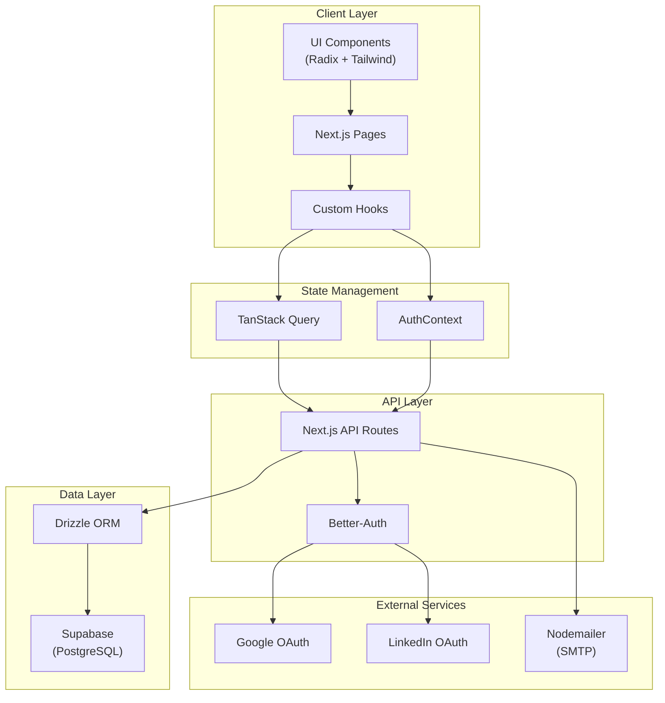

# SharingMinds - Technical Documentation

> **Mentor Onboarding Platform** - A Next.js application for expert/mentor registration and onboarding for the SharingMinds mentor-mentee connect platform.

---

## Table of Contents

1. [Technology Stack](#technology-stack)
2. [Project Structure](#project-structure)
3. [Architecture Overview](#architecture-overview)
4. [Database Schema](#database-schema)
5. [Authentication System](#authentication-system)
6. [API Routes](#api-routes)
7. [Components](#components)
8. [Providers & Context](#providers--context)
9. [Key Features](#key-features)
10. [Development Commands](#development-commands)

---

## Technology Stack

| Category | Technology | Version |
|----------|------------|---------|
| **Framework** | Next.js | 14.2.16 |
| **Language** | TypeScript | ^5 |
| **Styling** | Tailwind CSS | ^3.4.17 |
| **Database** | PostgreSQL (via Supabase) | - |
| **ORM** | Drizzle ORM | ^0.44.5 |
| **Authentication** | Better-Auth | ^1.3.9 |
| **State Management** | TanStack React Query | ^5.83.0 |
| **UI Components** | Radix UI | latest |
| **Icons** | Lucide React + React Icons | ^0.454.0 / ^5.5.0 |
| **Form Handling** | React Hook Form + Zod | latest / ^3.24.1 |
| **Email** | Nodemailer | ^7.0.5 |
| **Theming** | next-themes | latest |

---

## Project Structure

```
sm-expert-landing-page/
├── app/                          # Next.js App Router
│   ├── api/                      # API Routes
│   │   ├── auth/                 # Authentication endpoints
│   │   │   ├── [...better-auth]/ # Better-Auth catch-all handler
│   │   │   ├── send-otp/         # OTP sending endpoint
│   │   │   ├── session-with-roles/ # Session + roles query
│   │   │   └── verify-otp/       # OTP verification endpoint
│   │   ├── contact/              # Contact form submissions
│   │   ├── locations/            # Location data endpoints
│   │   └── mentors/              # Mentor CRUD operations
│   ├── about/                    # About page
│   ├── auth/                     # Auth pages
│   │   ├── login/                # Login page
│   │   └── verify-email/         # Email verification
│   ├── contact/                  # Contact page
│   ├── policies/                 # Legal policies
│   ├── registration/             # Mentor registration form
│   ├── service/                  # Service pages
│   ├── verify-email/             # Email verification flow
│   ├── vip-lounge/               # VIP member area
│   ├── globals.css               # Global styles
│   ├── layout.tsx                # Root layout
│   ├── page.tsx                  # Home/Landing page
│   └── AppLayout.tsx             # App-level layout wrapper
├── components/                   # React components
│   ├── ui/                       # 51 Radix-based UI primitives
│   ├── auth/                     # Authentication components
│   ├── common/                   # Shared components (ErrorBoundary)
│   ├── dashboard/                # Dashboard components
│   │   ├── dashboard-sidebar.tsx # Navigation sidebar
│   │   ├── stat-card.tsx         # Metric card for overview
│   │   ├── coming-soon-card.tsx  # Placeholder for unreleased sections
│   │   └── mentor-profile-edit.tsx # Full profile editor
│   ├── providers/                # Component providers
│   ├── vip/                      # VIP-specific components
│   ├── hero-section.tsx          # Landing hero section
│   ├── benefits-section.tsx      # Benefits showcase
│   ├── testimonial-section.tsx   # Testimonials carousel
│   ├── final-cta-section.tsx     # Call-to-action section
│   ├── header.tsx                # Site header/navigation
│   ├── footer.tsx                # Site footer
│   └── theme-*.tsx               # Theme components
├── contexts/                     # React Contexts
│   └── auth-context.tsx          # Authentication context
├── hooks/                        # Custom React hooks
│   ├── queries/                  # React Query hooks
│   ├── use-mentor-status.ts      # Mentor status hook
│   ├── use-mobile.tsx            # Mobile detection hook
│   ├── use-scroll-animation.tsx  # Scroll animations hook
│   └── use-toast.ts              # Toast notifications hook
├── lib/                          # Utilities & configurations
│   ├── db/                       # Database layer
│   │   ├── schema/               # Drizzle schema definitions
│   │   ├── migrations/           # Database migrations
│   │   ├── index.ts              # DB connection
│   │   └── user-helpers.ts       # User query helpers
│   ├── storage/                  # File storage utilities
│   ├── validations/              # Zod validation schemas
│   ├── auth.ts                   # Better-Auth configuration
│   ├── auth-client.ts            # Client-side auth
│   ├── emails.ts                 # Email utilities
│   ├── legal-documents.ts        # Legal content
│   ├── otp.ts                    # OTP generation/verification
│   ├── react-query.ts            # React Query config
│   ├── supabase.ts               # Supabase client
│   └── utils.ts                  # General utilities
├── providers/                    # App-level providers
│   └── query-provider.tsx        # React Query provider
├── public/                       # Static assets
├── styles/                       # Additional styles
└── configuration files           # package.json, tsconfig, etc.
```

---

## Architecture Overview



---

## Database Schema

The application uses **Drizzle ORM** with **PostgreSQL** (Supabase). Schema files are located in `lib/db/schema/`.

### Core Tables

| Table | Description | File |
|-------|-------------|------|
| `users` | Base user accounts | `users.ts` |
| `mentors` | Mentor profiles with details | `mentors.ts` |
| `mentees` | Mentee profiles | `mentees.ts` |
| `roles` | Available roles (admin, mentor, mentee) | `roles.ts` |
| `user_roles` | User-role assignments | `user-roles.ts` |
| `contact_submissions` | Contact form entries | `contact-submissions.ts` |
| `email_verifications` | Email verification tokens | `email-verifications.ts` |

### Auth Tables (Better-Auth)

| Table | Description | File |
|-------|-------------|------|
| `better_auth_sessions` | User sessions | `auth.ts` |
| `better_auth_accounts` | OAuth accounts | `auth.ts` |
| `better_auth_verifications` | Auth verifications | `auth.ts` |

### Key Schema: Users

```typescript
users = pgTable('users', {
  id: text('id').primaryKey(),
  email: text('email').notNull().unique(),
  emailVerified: boolean('email_verified').default(false),
  name: text('name'),
  image: text('image'),
  googleId: text('google_id').unique(),
  firstName: text('first_name'),
  lastName: text('last_name'),
  phone: text('phone'),
  bio: text('bio'),
  timezone: text('timezone').default('UTC'),
  isActive: boolean('is_active').default(true),
  isBlocked: boolean('is_blocked').default(false),
  createdAt: timestamp('created_at'),
  updatedAt: timestamp('updated_at'),
});
```

### Key Schema: Mentors

```typescript
mentors = pgTable('mentors', {
  id: uuid('id').defaultRandom().primaryKey(),
  userId: text('user_id').references(() => users.id),
  title: text('title'),
  company: text('company'),
  industry: text('industry'),
  expertise: text('expertise'),
  experience: integer('experience_years'),
  hourlyRate: decimal('hourly_rate'),
  currency: text('currency').default('USD'),
  availability: text('availability'),
  maxMentees: integer('max_mentees').default(10),
  headline: text('headline'),
  about: text('about'),
  linkedinUrl: text('linkedin_url'),
  githubUrl: text('github_url'),
  websiteUrl: text('website_url'),
  fullName: text('full_name'),
  email: text('email'),
  phone: text('phone'),
  city: text('city'),
  country: text('country'),
  profileImageUrl: text('profile_image_url'),
  resumeUrl: text('resume_url'),
  verificationStatus: verificationStatusEnum('verification_status'), // YET_TO_APPLY, IN_PROGRESS, VERIFIED, REJECTED, REVERIFICATION
  isAvailable: boolean('is_available').default(true),
  createdAt: timestamp('created_at'),
  updatedAt: timestamp('updated_at'),
});
```

---

## Authentication System

### Better-Auth Configuration (`lib/auth.ts`)

The app uses **Better-Auth** with the following features:

- **Email/Password Authentication**: Enabled
- **Social Providers**:
  - Google OAuth (with offline access & consent prompt)
  - LinkedIn OAuth (OpenID Connect)
- **Session Management**:
  - Expiry: 7 days
  - Update age: 24 hours
- **Database Hooks**: Auto-assigns "mentee" role on first session creation

### Auth Context (`contexts/auth-context.tsx`)

Provides authentication state throughout the app:

```typescript
type AuthState = {
  session: unknown
  isAuthenticated: boolean
  isLoading: boolean
  roles: UserRole[]
  primaryRole: UserRole | null
  mentorProfile: MentorProfile | null
  isAdmin: boolean
  isMentor: boolean
  isMentee: boolean
  isMentorWithIncompleteProfile: boolean
  signIn: (provider, credentials) => Promise<unknown>
  signOut: () => Promise<void>
  refreshUserData: () => Promise<void>
  error: string | null
}
```

### Available Hooks

| Hook | Purpose |
|------|---------|
| `useAuth()` | Access full auth state |
| `useUserRoles()` | Access roles & mentor profile |
| `useMentorStatus()` | Check mentor verification status |

---

## API Routes

| Route | Method | Description |
|-------|--------|-------------|
| `/api/auth/[...better-auth]` | ALL | Better-Auth handler (login, logout, OAuth callbacks) |
| `/api/auth/send-otp` | POST | Send OTP to email |
| `/api/auth/verify-otp` | POST | Verify OTP code |
| `/api/auth/session-with-roles` | GET | Get session with user roles |
| `/api/contact` | POST | Submit contact form |
| `/api/locations/*` | GET | Location data (countries, states, cities) |
| `/api/mentors/*` | CRUD | Mentor profile operations |

---

## Components

### Landing Page Sections

| Component | File | Description |
|-----------|------|-------------|
| `HeroSection` | `hero-section.tsx` | Main hero with social login, testimonial preview |
| `BenefitsSection` | `benefits-section.tsx` | Platform benefits showcase |
| `TestimonialSection` | `testimonial-section.tsx` | Mentor testimonials carousel |
| `FinalCTASection` | `final-cta-section.tsx` | Final call-to-action |

### UI Components (`components/ui/`)

51 Radix-based primitives including:
- **Layout**: `Card`, `Sheet`, `Dialog`, `Drawer`, `Tabs`, `Accordion`
- **Forms**: `Input`, `Button`, `Checkbox`, `Select`, `Textarea`, `Form`
- **Feedback**: `Toast`, `Alert`, `Progress`, `Skeleton`
- **Navigation**: `NavigationMenu`, `Menubar`, `Breadcrumb`, `Pagination`
- **Data Display**: `Table`, `Avatar`, `Badge`, `Calendar`, `Chart`
- **Overlay**: `Popover`, `Tooltip`, `HoverCard`, `DropdownMenu`, `ContextMenu`

### Dashboard Components (`components/dashboard/`)

| Component | File | Description |
|-----------|------|-------------|
| `DashboardSidebar` | `dashboard-sidebar.tsx` | Navigation sidebar with mentor avatar + nav links |
| `StatCard` | `stat-card.tsx` | Metric card for the overview page |
| `ComingSoonCard` | `coming-soon-card.tsx` | Placeholder for unreleased sections |
| `MentorProfileEdit` | `mentor-profile-edit.tsx` | Full profile editor with file uploads |

All dashboard components support **dark and light mode** via Tailwind's `dark:` variant, controlled by a theme toggle in the dashboard header (`layout.tsx`).

---

## Providers & Context

### Provider Hierarchy (from `layout.tsx`)

```
<ErrorBoundary>
  <QueryProvider>              {/* TanStack Query */}
    <ThemeProvider>            {/* Next-themes */}
      <AuthProvider>           {/* Auth context */}
        <AppLayout>            {/* Header + Footer + Toaster */}
          {children}
        </AppLayout>
      </AuthProvider>
    </ThemeProvider>
  </QueryProvider>
</ErrorBoundary>
```

---

## Key Features

### 1. Mentor Onboarding Flow

1. **Landing Page** → User discovers the platform
2. **Social Login** → Google or LinkedIn authentication
3. **Registration Form** → Comprehensive mentor profile form (`RegistrationForm.tsx` - 57KB)
4. **Email Verification** → OTP-based email verification
5. **Profile Verification** → Admin review process (status: YET_TO_APPLY → IN_PROGRESS → VERIFIED)

### 2. Role-Based Access

- **Mentee**: Default role assigned on signup
- **Mentor**: Requires profile completion and verification
- **Admin**: Platform administrators

### 3. Verification Statuses

```typescript
enum VerificationStatus {
  YET_TO_APPLY = 'YET_TO_APPLY',
  IN_PROGRESS = 'IN_PROGRESS',
  VERIFIED = 'VERIFIED',
  REJECTED = 'REJECTED',
  REVERIFICATION = 'REVERIFICATION'
}
```

---

## Development Commands

| Command | Description |
|---------|-------------|
| `npm run dev` | Start development server |
| `npm run build` | Build for production |
| `npm run start` | Start production server |
| `npm run lint` | Run ESLint |

---

## Environment Variables

Required environment variables (see `.env.local`):

| Variable | Description |
|----------|-------------|
| `GOOGLE_CLIENT_ID` | Google OAuth client ID |
| `GOOGLE_CLIENT_SECRET` | Google OAuth client secret |
| `LINKEDIN_CLIENT_ID` | LinkedIn OAuth client ID |
| `LINKEDIN_CLIENT_SECRET` | LinkedIn OAuth client secret |
| `BETTER_AUTH_SECRET` | Session encryption secret |
| `DATABASE_URL` | PostgreSQL connection string |
| `NEXT_PUBLIC_SUPABASE_URL` | Supabase project URL |
| `NEXT_PUBLIC_SUPABASE_ANON_KEY` | Supabase anonymous key |
| SMTP config | Nodemailer SMTP settings |

---

## Fonts

| Font | Variable | Usage |
|------|----------|-------|
| Open Sans | `--font-open-sans` | Body text |
| Montserrat | `--font-montserrat` | Headings |

---

*Last updated: 15 February 2026*
